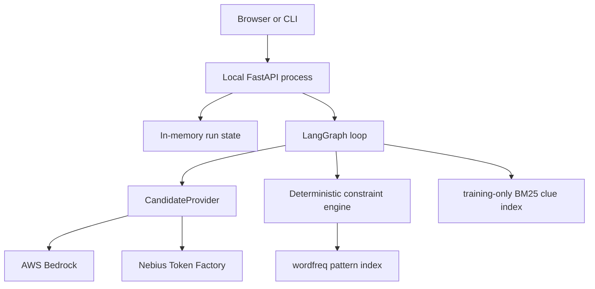

# Crossword Agent

A provider-neutral crossword agent that combines LLM clue solving with deterministic
constraint search. LangGraph manages the closed loop; the model proposes answers, while
ordinary Python owns lengths, crossing consistency, backtracking, budgets, and failure states.

The default provider is AWS Bedrock using the global Claude Sonnet 5 inference profile. The
web app, API, run state, worker, and constraint engine all run in one local process; only model
inference leaves the machine. A Nebius Token Factory adapter is available behind the same
provider interface.

## What is implemented

- Concurrent batched structured candidate generation through Bedrock or Nebius.
- Explicit puzzle, entry, intersection, candidate, state, and snapshot models.
- N-best weighted constraint search with MRV ordering and forward compatibility checks.
- Targeted re-query, crossing-aware reconsideration, and answer verification.
- Local pattern/frequency support from `wordfreq`; it never hard-rejects proper nouns.
- Optional BM25 clue retrieval built from a separate human CrosswordQA training artifact.
- Reproducible preparation for CrossWordBench and MadBonze human-style grids.
- CLI, local web UI, in-process background solving, in-memory run state, and quotas.
- Candidate recall/oracle diagnostics, reproducible evaluation metrics, and four ablation modes.

## Architecture

```text
Browser / CLI
      |
Local FastAPI process
      +--> in-memory run state
      |
LangGraph agent loop
      +--> CandidateProvider --> Bedrock or Nebius
      |
Deterministic weighted constraint engine
      |
Pattern lexicon + optional training-only clue index
```



The API accepts only an allow-listed puzzle ID. It cannot accept clues, grids, prompts, model
IDs, system instructions, or generation settings.

## Prerequisites

- Python 3.12
- `uv`
- A Bedrock API key or another local AWS credential supported by the AWS SDK
- Hugging Face CLI access to the selected dataset for preparation
- Docker, only if you want to run the local container

Install the project:

```bash
uv sync --all-groups
cp .env.example .env
```

Put the local Bedrock API key in `.env` as `AWS_BEARER_TOKEN_BEDROCK`. The app loads `.env`
automatically.

## Prepare CrossWordBench

Dataset acquisition is deliberately separate from the agent. The preparation script has its
own PEP 723 dependencies, downloads through the authenticated Hugging Face filesystem, and
writes the provider-neutral JSON contract consumed by the app. Polars and `huggingface-hub`
are not runtime dependencies of `crossword-agent`.

Authenticate once:

```bash
hf auth login
```

Prepare a deterministic 20-puzzle 7×7 demo set:

```bash
uv run scripts/prepare_crosswordbench.py \
  --variant english_simple \
  --size 7x7 \
  --limit 20 \
  --seed 20260920 \
  --split demo \
  --output data/crosswordbench/english-simple-demo-7x7.json
```

The script reads:

```text
hf://datasets/HINT-lab/CrossWordBench/english_simple/7x7-00000-of-00001.parquet
```

Use `--variant english` to prepare the original English benchmark instead. The
`english_simple` variant currently provides 7×7 puzzles; 14×14 remains available under
`english`.

Generated dataset files are ignored by Git and are not redistributed with this repository.
If the upstream parquet schema changes, inspect it without writing output:

```bash
uv run scripts/prepare_crosswordbench.py \
  --variant english_simple \
  --size 7x7 \
  --inspect
```

Preparation prints elapsed-time progress while reading and converting the parquet. If no rows
can be converted, it also writes a sanitized
`data/crosswordbench/demo-7x7.diagnostic.json` containing the schema and one sample row.

Then configure the agent to consume the prepared artifact:

```bash
echo 'CROSSWORD_DATASET_PATH=data/crosswordbench/demo-7x7.json' >> .env
```

## Prepare MadBonze human-style grids

MadBonze provides complete crossword grids together with positioned clues and answer maps.
This importer converts those rows into the same normalized JSON contract used by the UI, so no
grid reconstruction is needed at runtime:

```bash
uv run scripts/prepare_madbonze.py \
  --split train \
  --limit 500 \
  --output data/madbonze/train.json
```

Use `--split test` for the held-out CSV. The script reads
`hf://datasets/MadBonze/puzzles/train.csv` or `test.csv` after `hf auth login`, and it skips
rows that cannot be normalized while reporting the first failures.

Then configure the app:

```bash
echo 'CROSSWORD_DATASET_PATH=data/madbonze/train.json' >> .env
```

### Human clue-answer retrieval with CrosswordQA

CrosswordQA is a clue-answer corpus, not a grid-puzzle corpus. Use it to improve candidate
generation, while keeping a separate grid dataset in `CROSSWORD_DATASET_PATH` for crossing
evaluation:

```bash
uv run scripts/build_crosswordqa_index.py \
  --split train \
  --limit 500000 \
  --output data/crosswordqa/train-clue-index.json
```

Then configure:

```bash
CROSSWORD_CLUE_INDEX_PATH=data/crosswordqa/train-clue-index.json
```

The validation CSV can be indexed separately for a retrieval-only diagnostic, but should not
be used to build the production training index:

```bash
uv run scripts/build_crosswordqa_index.py \
  --split validation \
  --limit 100000 \
  --output data/crosswordqa/validation-clue-index.json
```

### Optional leak-free retrieval from grid puzzles

The app does not index the demo/evaluation puzzles. To use clue retrieval, first prepare
disjoint development and evaluation artifacts from one seeded ordering:

```bash
uv run scripts/prepare_crosswordbench.py \
  --size 7x7 \
  --limit 60 \
  --offset 0 \
  --seed 20260920 \
  --split development \
  --output data/crosswordbench/development-7x7.json

uv run scripts/prepare_crosswordbench.py \
  --size 7x7 \
  --limit 20 \
  --offset 60 \
  --seed 20260920 \
  --split evaluation \
  --output data/crosswordbench/evaluation-7x7.json
```

Build the local BM25 index from development clues while explicitly excluding the evaluation
artifact:

```bash
uv run python scripts/build_clue_index.py \
  --dataset data/crosswordbench/development-7x7.json \
  --exclude-dataset data/crosswordbench/evaluation-7x7.json \
  --output data/crosswordbench/clue-index.json
```

Then point the runtime at the evaluation puzzles and training-only index:

```bash
CROSSWORD_DATASET_PATH=data/crosswordbench/evaluation-7x7.json
CROSSWORD_CLUE_INDEX_PATH=data/crosswordbench/clue-index.json
```

The index builder rejects `demo` and `evaluation` splits by default and removes overlapping
puzzle IDs and exact clue-answer pairs supplied through `--exclude-dataset`.

## Run locally

List the configured puzzles:

```bash
uv run crossword list-puzzles
```

Solve one with Bedrock:

```bash
uv run crossword solve \
  --puzzle <ID_FROM_LIST_PUZZLES>
```

Run the web interface:

```bash
uv run crossword serve
```

Then open `http://127.0.0.1:8000`.

## Local logs

The app writes readable operational logs to the terminal and structured JSON Lines to
`logs/crossword-agent.jsonl`. The file rotates at 5 MB with five backups by default. Caught
provider, worker, dispatch, and unhandled API exceptions include complete stack traces and
request/run context without logging prompts, clues, model output, or credentials.

Inspect the live log:

```bash
tail -f logs/crossword-agent.jsonl | jq .
```

Logging can be configured in `.env` with `LOG_LEVEL`, `LOG_FILE`, `LOG_MAX_BYTES`, and
`LOG_BACKUP_COUNT`.

The app also writes hierarchical agent spans to
`logs/crossword-agent-traces.jsonl`. A frontend solve produces a trace shaped like:

```text
http.request
└─ agent.solve
   └─ agent.graph
      ├─ agent.initialize
      ├─ agent.generate
      │  └─ gen_ai.generate_candidates
      ├─ agent.validate
      ├─ agent.search
      ├─ agent.assess
      └─ agent.finalize
```

Every span includes trace, span, and parent IDs, timestamps, duration, status, safe attributes,
events, and exception stack traces. The same trace and span IDs are injected into application
logs and W3C `traceparent` response headers.

Inspect the latest trace as a tree:

```bash
uv run python scripts/inspect_trace.py
```

Tracing is configured with `TRACE_ENABLED`, `TRACE_FILE`, `TRACE_MAX_BYTES`,
`TRACE_BACKUP_COUNT`, and `OTEL_SERVICE_NAME`.

For a local container:

```bash
docker build -t crossword-agent .
docker run --rm -p 8000:8000 \
  --env-file .env \
  -e CROSSWORD_DATASET_PATH=/data/crosswordbench/demo-7x7.json \
  -v "$PWD/data/crosswordbench:/data/crosswordbench:ro" \
  crossword-agent
```

## Provider configuration

Bedrock is the default. These values belong in `.env`:

```bash
AWS_BEARER_TOKEN_BEDROCK=...
LLM_PROVIDER=bedrock
BEDROCK_REGION=ap-southeast-2
BEDROCK_MODEL_ID=global.anthropic.claude-sonnet-5
```

Switch to Nebius without changing the agent:

```bash
export LLM_PROVIDER=nebius
export NEBIUS_API_KEY=...
export NEBIUS_MODEL_ID=Qwen/Qwen3-235B-A22B
```

The final model should be selected from the planned 20-puzzle development bake-off rather than
from general model benchmarks alone. Compare candidate recall and oracle-solvable rate as well
as final grid accuracy: a search engine cannot recover an answer that never entered its domain.

## Public API

```text
GET  /
GET  /api/health
GET  /api/puzzles/random
POST /api/runs              {"puzzle_id": "<allow-listed UUID>"}
GET  /api/runs/{run_id}
```

`POST /api/runs` rejects every additional field. The local process permits one active run and
ten new runs per UTC day. Run history is intentionally ephemeral and resets when the process
restarts.

## Normalized dataset contract

The standalone preparation step and the agent communicate through an explicit-entry JSON
contract. Entry positions and IDs come from CrossWordBench rather than being inferred or
renumbered:

```json
[
  {
    "id": "puzzle-id",
    "title": "Example",
    "split": "evaluation",
    "solution": ["CAT", "ARE", "TEN"],
    "entries": [
      {
        "id": "1A",
        "number": 1,
        "direction": "across",
        "clue": "Pet",
        "answer": "CAT",
        "start": [0, 0]
      },
      {
        "id": "1D",
        "number": 1,
        "direction": "down",
        "clue": "Pet",
        "answer": "CAT",
        "start": [0, 0]
      }
    ]
  }
]
```

The legacy `across`/`down` mapping remains supported for the small bundled fallback dataset.

For CrossWordBench, `reference_answer` defines the playable task. The source
`puzzle_state.wordlist` may contain additional generator placements that are not benchmark
answers; preparation reports their count and masks cells used only by those placements instead
of dropping the entire puzzle.

Run all four ablations:

```bash
uv run crossword evaluate \
  --dataset /path/to/normalized-crosswordbench.json \
  --provider nebius \
  --output output/evaluation/results.md
```

This writes a human-readable Markdown table and a raw JSON result file. Metrics include letter
accuracy, word accuracy, exact-puzzle solve rate, constraint violations, model calls, token
usage, latency, and candidate replacements.

Run the full agent over a reproducible 20-puzzle sample and generate a self-contained HTML
dashboard:

```bash
uv run python scripts/benchmark_agent.py \
  --dataset data/crosswordbench/demo-7x7.json \
  --count 20 \
  --seed 20260920 \
  --provider bedrock \
  --output output/benchmark/dashboard.html
```

The dashboard is updated after every puzzle and is accompanied by
`output/benchmark/dashboard.json`. It reports exact puzzle solve rate, word and letter accuracy,
intersection consistency, wrong-word recovery, revisions, LLM tool calls, token usage,
and end-to-end latency. It also reports initial and final candidate recall at 1/5/10, mean
reciprocal rank, and oracle solve rate. Oracle solve rate answers the key diagnostic question:
did every gold answer enter the candidate domains at all?

Run the prescribed study split—20 development puzzles, the three separate bundled demos,
50 held-out 7×7 puzzles, 20 held-out 14×14 puzzles, and a fixed 20-puzzle ablation subset:

```bash
uv run crossword evaluate-study \
  --dataset /path/to/normalized-crosswordbench.json \
  --provider nebius \
  --seed 20260919 \
  --output output/evaluation
```

Run the 20-puzzle Nebius model bake-off:

```bash
uv run crossword bakeoff \
  --dataset /path/to/normalized-crosswordbench.json \
  --output output/evaluation/bakeoff.md
```

The bake-off ranks models by word accuracy, full-puzzle solve rate, then p50 latency.

Ablations:

1. `single_shot`: one batched model response, top candidate for each clue.
2. `top1_constraints`: top candidates placed only when currently crossing-compatible.
3. `constraint_search`: multi-candidate deterministic search without re-query.
4. `full`: retrieval/lexical support, N-best search, information-gain re-query, and verification.

## Tests and quality checks

```bash
uv run pytest
uv run ruff check src tests scripts
```

Cloud integration tests are intentionally not part of the default test run because they consume
model tokens. Unit tests use a scripted provider and verify parsing, constraints, recovery,
failure states, metrics, API input rejection, locking, and quotas.

## Deliberate boundaries

- Text puzzles only; no OCR or image parsing.
- Standard American-style entries; no rebus or cryptic support.
- No web search, fine-tuning, WordNet, or model-controlled tools.
- Gold answers never enter the solver; the demo UI exposes them only after a run finishes.
- Evaluation/demo answers are prohibited from the optional clue index.
- Retrieval and lexical data influence ranking but are never a hard source of truth.

## Documented failure case

A plausible but incorrect answer can have temporarily consistent crossings. The solver therefore
retains several full-grid hypotheses and requires targeted verification before accepting a
complete grid. Re-query patterns keep only stable, well-supported crossing letters as hard
constraints; weaker letters remain tentative context. Candidates are rejected only after global
search replaces them, not merely because a clue was queried again. The model is never asked to
self-report confidence. Candidate ordering uses rank, lexical/retrieval evidence, and verifier
corroboration strictly as a search utility—not as a correctness probability. If verification
does not complete, the run terminates as `STALLED` or `BUDGET_EXCEEDED` with the best available
assignment instead of claiming a solve. A complete grid that reaches this limit is shown in the
demo UI as `REVIEW NEEDED`.

## One-minute demo outline

1. Explain the LLM-versus-constraint-engine split.
2. Select a prepared CrossWordBench puzzle and start a live solve.
3. Show a weak answer being reconsidered after a crossing conflict.
4. Show the ablation table and Nebius provider configuration.
